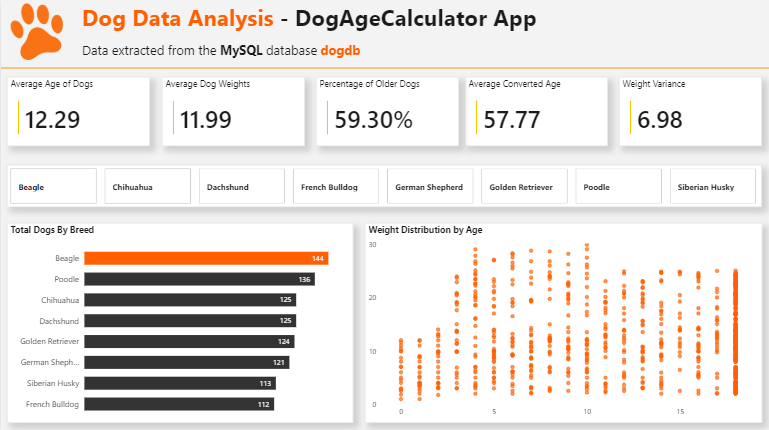
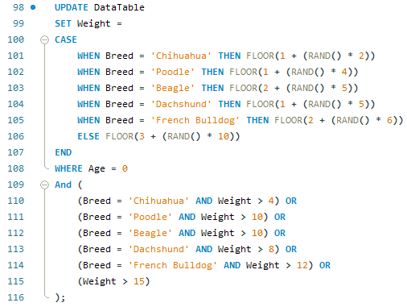
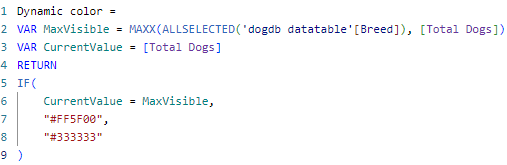
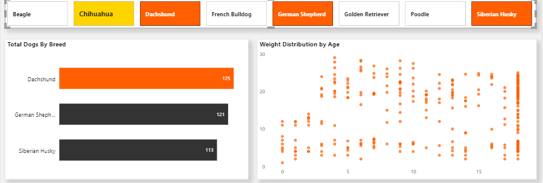
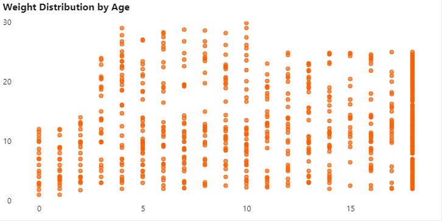

# DogAgeCalculator-Data-Pipeline

Data generated from the C# Dog Age Calculator project is collected in a MySQL database, and analyzed and visualized in an interactive Power BI dashboard.

## Data Pipeline
C# App (Generation) → Text Files → MySQL (Persistence and SQL Cleanup) → Power BI (Analysis and UI).

## Features
- **Data Normalization & Cleaning:** Processing raw data using SQL to standardize breed names, correct typing errors, and filter out biologically impossible values.
- **Dog Data Metrics:** Visualization of key KPIs such as average converted age, weight variance, and demographic distribution by life stage (puppies vs. adults).
- **Dynamic Visual Highlighting:** Implementation of custom DAX logic to automatically highlight the most populated race based on applied filters.
- **Interactive UI/UX:** Interface designed with a consistent color palette (Orange/Charcoal Gray) and data slicers with visual states of "Hover" and "Selected" for a desktop application-like experience.

## Technologies
- **MySQL Workbench:** Database engine for persistence and normalization.
- **SQL (MySQL):** Script for creating the **dogdb** database and cleaning the data.
- **Power BI:** Dynamic dashboard with custom DAX logic.
- **DAX (Power BI):** Language used to create calculated measures and dynamic conditional formatting.
- [**mysql-connector-net-9.7.0.msi:**](https://dev.mysql.com/downloads/connector/net/) Tool that connects MySQL Workbench to Power BI.

## How to Run the Project
1. Database Setup: Run the **dog_Query.sql** script in MySQL Workbench to start the **dogdb** database.
2. Data Import: Move the **dog_sample_.txt** file to the MySQL secure folder. Path is "C:\ProgramData\MySQL\MySQL Server 8.0\Uploads\dog_sample_.txt"
3. Connector Installation: Install the MySQL Connector/Net to allow Power BI to communicate with the local database.
4. Open Dashboard: Open the **DataAnalysis_DogDB.pbix** file. If necessary, update the data source credentials in "Transform Data" > "Data Source Settings".  

## Screenshots

### Data Cleaning
To ensure data integrity, a script is developed to manage outliers in weight records.

### Data Visualization
The dashboard uses a custom DAX measure to highlight the breed with the highest population in real-time.

The dashboard uses a multi-selection breed slicer to query breed-specific data.

The dashboard uses a scatter plot that shows the age-weight relationship of the dogs

## Author
Sebastián Zúñiga Torres
